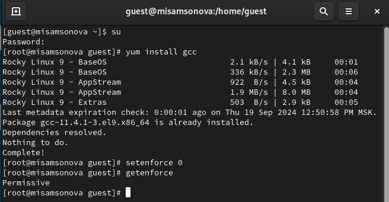

---
## Front matter
lang: ru-RU
title: Лабораторная работа №5
subtitle:  Дискреционное разграничение прав в Linux. Исследование
влияния дополнительных атрибутов
author: |
        Самсонова Мария Ильинична
        \        
        НФИбд-02-21
        \
        Студ. билет: 1032216526
institute: |
           RUDN
date: |
      2024

babel-lang: russian
babel-otherlangs: english
mainfont: Arial
monofont: Courier New
fontsize: 9pt

## Formatting
toc: false
slide_level: 2
theme: metropolis
header-includes: 
 - \metroset{progressbar=frametitle,sectionpage=progressbar,numbering=fraction}
 - '\makeatletter'
 - '\beamer@ignorenonframefalse'
 - '\makeatother'
aspectratio: 43
section-titles: true
---

# Теоретическое введение

Дискреционное разграничение доступа — управление доступом субъектов к объектам на основе списков управления доступом или матрицы доступа. Также используются названия дискреционное управление доступом, контролируемое управление доступом и разграничительное управление доступом. [2]

## SetUID

setuid и setgid (сокращения от англ. set user ID upon execution — «установка ID пользователя во время выполнения» и англ. set group ID upon execution — «установка ID группы во время выполнения») являются флагами прав доступа в Unix, которые разрешают пользователям запускать исполняемые файлы с правами владельца или группы исполняемого файла.  [3]

## Sticky

Sticky bit используется в основном для каталогов, чтобы защитить в них файлы. Из такого каталога пользователь может удалить только те файлы, владельцем которых он является. Примером может служить каталог /tmp, в который запись открыта для всех пользователей, но нежелательно удаление чужих файлов. [4]

# Цель работы

Изучение механизмов изменения идентификаторов, применения SetUID- и Sticky-битов. Получение практических навыков работы в консоли с дополнительными атрибутами. Рассмотрение работы механизма смены идентификатора процессов пользователей, а также влияние бита Sticky на запись и удаление файлов.

# Выполнение лабораторной работы. Подготовка лабораторного стенда

{ #fig:001 width=70% height=70% }

# Выполнение лабораторной работы.Создание программы

1. Зашли в систему от имени пользователя guest.

2. Создали файл simpleid.c, записали в него программу, скоплировали и запустили его. Программа дала те же результаты, что и консольная команда id. (@fig:001, @fig:002)

{ #fig:001 width=70%}

# Содержимое файла simpleid.c

{ #fig:002 width=70%}

# Работа в консоли с файлом simpleid2.c

3. Создали файл simpleid2.c, записали в него программу, скоплировали и запустили его. (@fig:003, @fig:004)

{ #fig:003 width=70%}

# Содержимое файла simpleid2.c

{ #fig:004 width=70%}

# Изменение прав файла simpleid2

4. Изменили права файла simpleid2 от имени суперпользователя. (@fig:005)

{ #fig:005 width=70%}

# Проверка прав файла simpleid2, его запуск и команда id

5. Выполнили проверку установки правил. Запустили simpleid2 и id. Получили одинаковы результаты с id=0. (@fig:006)

{ #fig:006 width=70%}

# Выполнения файла с SetGID-битом

6. Повторили п.5 для SetGID-бита. (@fig:007)

{ #fig:007 width=70%}

# Содержимое файла readfile.c

7. Создали программу readfile.c и откомпелировали ее. (@fig:008, @fig:009)

{ #fig:008 width=70%}

# Создание и компелирование readfile.c

{ #fig:009 width=70%}

# Изменение прав файла readfile.c

8. Изменили права так, чтобы только суперпользователь (root) мог прочитать readfile.c, a guest не мог. (@fig:010)

{ #fig:010 width=70%}

# Чтение readfile.c пользователем guest

9. Проверили, что guest не модет прочитать файл. (@fig:011)

{ #fig:011 width=70%}

# Смена прав у readfile

10. Сменили у программы readfile владельца и установили SetU’D-бит. (@fig:012)

{ #fig:012 width=70%}

# Чтение readfile.c через readfile

11. Считали программой readfile readfile.c и /etc/shadow. (@fig:013, @fig:014)

{ #fig:013 width=70%}

# Чтение /etc/shadow через readfile

{ #fig:014 width=70%}

# Исследование Sticky-бита. Создание и изменение прав файла /tmp/file01.txt

1. Проверили установлени ли на директории tmp атрибут Sticky. От имени пользователя guest создали file01.txt в директории /tmp  со словом test. Просмотрели атрибуты у файла и разрешили чтение и запись для категории пользователей «все остальные». (@fig:015)

{ #fig:015 width=70%}

# Взаймдействие с file01.txt пользователем guest2 c Sticky-bit

2. От имени пользователя guest2 попробовали прочитать, дозаписать, переписать и удалить файл file01.txt. (@fig:016)

{ #fig:016 width=70%}

# Взаймдействие с file01.txt пользователем guest2 без Sticky-bit

3. Суперпользователем сняли Sticky-bit с каталога tmp. Повторили действия с файлом из п.2. (@fig:017)

{ #fig:018 width=70%}

# Вывод

В ходе выполнения лабораторной работы были опробованы действия на практике SetUID- и Sticky-битов и рассмотрен механизм смены идентификатора процессов пользователей.

# Список литературы. Библиография

[1] Методические материалы курса.

[2] Wikipedia: Избирательное управление доступом. (URL: https://ru.wikipedia.org/wiki/%D0%98%D0%B7%D0%B1%D0%B8%D1%80%D0%B0%D1%82%D0%B5%D0%BB%D1%8C%D0%BD%D0%BE%D0%B5_%D1%83%D0%BF%D1%80%D0%B0%D0%B2%D0%BB%D0%B5%D0%BD%D0%B8%D0%B5_%D0%B4%D0%BE%D1%81%D1%82%D1%83%D0%BF%D0%BE%D0%BC)

[3] Wikipedia: suid (URL: https://ru.wikipedia.org/wiki/Suid)

[4] Wikipedia: Stiky bit (URL: https://ru.wikipedia.org/wiki/Sticky_bit)4. 