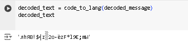

---
## Front matter
lang: ru-RU
title: Лабораторная работа №7
subtitle:  Элементы криптографии. Однократное гаммирование
author: |
        Самсонова Мария Ильинична
        \        
        НФИбд-02-21
        \
        Студ. билет: 1032216526
institute: |
           RUDN
date: | 
      2024

babel-lang: russian
babel-otherlangs: english
mainfont: Arial
monofont: Courier New
fontsize: 9pt

## Formatting
toc: false
slide_level: 2
theme: metropolis
header-includes: 
 - \metroset{progressbar=frametitle,sectionpage=progressbar,numbering=fraction}
 - '\makeatletter'
 - '\beamer@ignorenonframefalse'
 - '\makeatother'
aspectratio: 43
section-titles: true
---

# Теоретическое введение

Гамми́рование, или Шифр XOR, — метод симметричного шифрования, заключающийся в «наложении» последовательности, состоящей из случайных чисел, на открытый текст. Последовательность случайных чисел называется гамма-последовательностью и используется для зашифровывания и расшифровывания данных. Суммирование обычно выполняется в каком-либо конечном поле. Например, в поле Галуа GF(2) суммирование принимает вид операции «исключающее ИЛИ (XOR)». [2]


# Цель работы

Освоить на практике применение режима однократного гаммирования.

# Выполнение лабораторной работы

1. Была реализована программа на Python:

```
import numpy as np
from random import randrange

# 1. Задаем строку для шифрования
t = "С Новым Годом, друзья!"

# 2. Переводим строку в hex
hex_message = []
for i in t:
    hex_message.append(i.encode("cp866").hex())
print(hex_message)

```
# Выполнение лабораторной работы
```

# 3. Задаем ключ, такой же длины, что и строка шифрования
def gen_key(length: int):
    key = []
    for i in range(0, length):
        key.append(f"{randrange(255):02x}")  # Генерируем двухзначное hex-число
    return key

key_1 = gen_key(len(hex_message))
print(key_1)

# 4. Кодируем строку с помощью ключа
def encode_message(hex_message, key):
    return ["%x" % (int(x, 16) ^ int(y, 16)) for (x, y) in zip(hex_message, key)]

encoded_message = encode_message(hex_message, key_1)
print(encoded_message)
```

# Выполнение лабораторной работы

```

# Закодированное сообщение в виде текста
def code_to_lang(encoded_message):
    return bytearray.fromhex("".join(encoded_message)).decode("cp866")

encoded_text = code_to_lang(encoded_message)
print(encoded_text)

# 5. Задаем новый ключ шифрования
key_2 = gen_key(len(hex_message))
print(key_2)

```

# Выполнение лабораторной работы

```
# 6. Декодируем с помощью нового ключа
def decode_message(key, encoded_message):
    return ["%x" % (int(x, 16) ^ int(y, 16)) for (x, y) in zip(key, encoded_message)]

decoded_message = decode_message(key_2, encoded_message)
print(decoded_message)

decoded_text = code_to_lang(decoded_message)


# 7. Декодируем с помощью верного ключа
decoded_message_right = decode_message(key_1, encoded_message)
decoded_text_right = code_to_lang(decoded_message_right)
print(decoded_text_right)

```

# Выполнение лабораторной работы

2. Запустили программу. Получили:

- сообщение в hex

['91', '20', '8d', 'ae', 'a2', 'eb', 'ac', '20', '83', 'ae', 'a4', 'ae', 'ac', '2c', '20', 'a4', 'e0', 'e3', 'a7', 'ec', 'ef', '21']

- ключ для кодировки

['a6', 'd6', 'e8', '35', 'f3', '1d', '41', 'e1', '88', 'd1', 'bd', '2a', '16', '80', 'a2', '20', 'ed', '6a', 'fc', '67', 'ce', '9d']

- закодированное сообщение

['37', 'f6', '65', '9b', '51', 'f6', 'ed', 'c1', 'b', '7f', '19', '84', 'ba', 'ac', '82', '84', 'd', '89', '5b', '8b', '21', 'bc']

# Выполнение лабораторной работы

- закодированное сообщение в виде текста  (@fig:001)

{ #fig:001 width=100% }

# Выполнение лабораторной работы

- ключ для расшифровки

['7a', 'f1', '5b', '3e', 'ea', 'd', '9e', '23', 'd6', '3e', '40', 'd9', 'de', '6b', 'd8', '9b', 'b', '4f', '3a', '6e', '14', 'eb']

- сообщение, раскодированное ключом для расшифровки

['4d', '7', '3e', 'a5', 'bb', 'fb', '73', 'e2', 'dd', '41', '59', '5d', '64', 'c7', '5a', '1f', '6', 'c6', '61', 'e5', '35', '57']

# Выполнение лабораторной работы

- раскодированное сообщение текстом (@fig:002)

{ #fig:002 width=100%}

# Выполнение лабораторной работы

- текст сообщения, раскодированного ключом для кодировки  (@fig:003)

{ #fig:003 width=100%}


# Вывод

В ходе выполнения лабораторной работы было изучено шифрование методом однократного гаммирования и реализована программа на python, шифрующая и расшифровавующая заданную строку этим методом.


# Список литературы. Библиография

[1] Методические материалы курса.

[2] Wikipedia: Гаммирование (URL: https://ru.wikipedia.org/wiki/%D0%93%D0%B0%D0%BC%D0%BC%D0%B8%D1%80%D0%BE%D0%B2%D0%B0%D0%BD%D0%B8%D0%B5)
