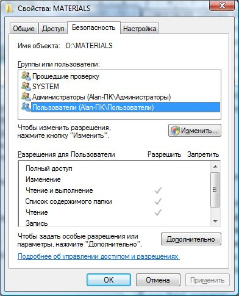
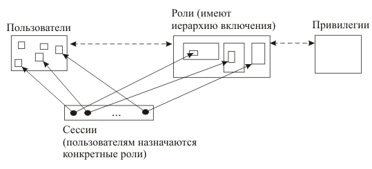

---
## Front matter
lang: ru-RU
title: "Доклад по теме: Основные модели безопасности ОС" 
subtitle: 
author: |
        Выполнила: Самсонова Мария Ильинична
        \
        Преподаватель Кулябов Дмитрий Сергеевич д.ф.-м.н.,
        \ 
        профессор кафедры теории вероятностей и кибербезопасности 
institute: |
           Российский университет дружбы народов, Москва, Россия
date: |
      21 марта 2024

babel-lang: russian
babel-otherlangs: english
mainfont: Arial
monofont: Courier New
fontsize: 9pt

## Formatting
toc: false
slide_level: 2
theme: metropolis
header-includes: 
 - \metroset{progressbar=frametitle,sectionpage=progressbar,numbering=fraction}
 - '\makeatletter'
 - '\beamer@ignorenonframefalse'
 - '\makeatother'
aspectratio: 43
section-titles: true
---

# Содержание

- Введение
- Модель безопасности
- Сетевая модель 
- Основные типы моделей безопасности
- Новые угрозы и уязвимости: Атаки на доверенные подсистемы
- Развитие гибридных моделей: Объединение нескольких моделей безопасности
- Заключение
- Библиографический обзор

# Информация о докладчике

:::::::::::::: {.columns align=center}
::: {.column width="70%"}

  * Самсонова Мария Ильинична
  * Студент группы НФИбд-02-21
  * Студенческий билет 1032216526
  * Российский университет дружбы народов

:::
::: {.column width="30%"}

:::
::::::::::::::

# Введение

Безопасность операционной системы — это совокупность мер, направленных на защиту данных и ресурсов компьютера от несанкционированного доступа, кражи, модификации и разрушения. Безопасность ОС охватывает не только защиту от внешних угроз (взлом, вирусы, кибератаки), но и внутренние аспекты, такие как управление правами доступа пользователей и контроль выполнения приложений.
Ключевые аспекты безопасности ОС:
•  Управление доступом: Определение, кто и какие ресурсы может использовать.

•  Аутентификация: Подтверждение личности пользователя или системы.

•  Автономная защита: Способность системы работать в условиях отключения внешних сервисов или сетей без снижения уровня безопасности.

•  Шифрование данных: Защита данных как в состоянии хранения, так и при передаче между компонентами системы.

•  Логирование и мониторинг: Отслеживание действий пользователей и событий, происходящих в системе для выявления и предотвращения потенциальных угроз.

# Модель безопасности
**Модель безопасности** — это формализованный подход, который определяет, как система должна контролировать доступ к ресурсам и защищать данные от несанкционированного использования. Она представляет собой теоретическое описание принципов, механизмов и правил, на основе которых строится защита информации и ресурсов внутри операционной системы.

# Что представляют собой модели безопасности?
Каждая модель безопасности **ориентирована** на достижение одной или нескольких ключевых целей безопасности, таких как конфиденциальность, целостность и доступность. Эти модели могут быть формализованы в виде правил и алгоритмов, которые затем реализуются на уровне ОС или специализированного программного обеспечения для защиты данных.

*Основные элементы моделей безопасности*
•  Субъекты — пользователи или процессы, которые запрашивают доступ к ресурсам.

•  Объекты — ресурсы, к которым запрашивается доступ (файлы, данные, приложения).

•  Правила доступа — условия, которые определяют, может ли субъект выполнить определенные действия с объектом.

Модели безопасности обычно делятся на категории в зависимости от того, какие аспекты безопасности они защищают и какие принципы управления доступом используют. Некоторые из моделей больше ориентированы на защиту конфиденциальности, в то время как другие делают акцент на целостности данных. 

# Основные типы моделей безопасности
## Дискреционные модели безопасности (Discretionary Access Control, DAC)

**Дискреционные модели** безопасности управляют правами доступа к ресурсам через владельцев этих ресурсов. Владельцы сами назначают или изменяют права доступа для других пользователей, основываясь на их идентичности.

Каждому объекту назначен субъект-владелец, который определяет, кто имеет доступ к объекту и какие операции разрешены. Основные операции включают: чтение (READ), запись (WRITE) и выполнение (EXECUTE, актуально только для программ). Таким образом, в модели дискреционного доступа для каждой пары субъект-объект задается разрешенный набор операций.

# Дискреционные модели безопасности (Discretionary Access Control, DAC)

Дискреционная модель реализована в операционных системах, таких как Windows и Linux (см. рис. 1).

# Мандатные модели безопасности (Mandatory Access Control, MAC)

**Мандатная модель безопасности** основана на мандатном управлении доступом. ***Мандатное управление доступом*** (Mandatory Access Control, MAC) — это механизм, основанный на присвоении меток конфиденциальности объектам и официальных разрешений (допусков) субъектам на доступ к информации определённого уровня. Такой подход предотвращает несанкционированное использование компьютерных процессов, данных и системных устройств. Иногда MAC также называют «Принудительным контролем доступа».
  
В мандатных моделях безопасности контроль доступа осуществляется на системном уровне и не может быть изменён пользователями. Система назначает метки безопасности субъектам и объектам, а доступ регулируется в соответствии с этими метками и установленными правилами.

# Мандатные модели безопасности (Mandatory Access Control, MAC)

Принципы мандатного контроля доступа впервые были реализованы в операционных системах, ориентированных на безопасность, таких как Flask. В 2003 году проект АНБ SELinux добавил архитектуру MAC к ядру Linux, что сделало эту модель частью основной ветви разработки. Мандатные системы доступа также реализованы в FreeBSD Unix, AppArmor для SUSE Linux и Ubuntu.

# Модели с ролевым разграничением доступа (Role-Based Access Control, RBAC)
В ролевых моделях доступ к ресурсам регулируется на основании ролей, назначаемых пользователям. Каждая роль содержит набор прав доступа, и пользователи получают доступ в зависимости от своей роли, а не индивидуальных разрешений.

**Ролевая модель** управления доступом определяет доступ пользователей к ресурсам на основе их ролей в системе, которые отражают их действия и обязанности. **Роль** — это совокупность действий, соответствующих определённой должности или функции. Примеры ролей включают: администратор базы данных, менеджер, начальник отдела.

# Модели с ролевым разграничением доступа (Role-Based Access Control, RBAC)

Ролевая модель широко используется в системах управления доступом, таких как Microsoft Active Directory, SELinux, FreeBSD, Solaris, СУБД Oracle, PostgreSQL, SAP R/3 и других. С помощью RBAC можно моделировать как дискреционные, так и мандатные системы управления доступом.

# Новые угрозы и уязвимости: Атаки на доверенные подсистемы
Атаки на доверенные подсистемы, такие как ядро ОС или гипервизоры, становятся всё более изощрёнными и опасными. Примеры таких атак включают:

•  Эксплойты на уязвимости ядра. Злоумышленники находят уязвимости в ядре ОС, что позволяет им обходить механизмы контроля доступа или получать повышенные привилегии.

•  Атаки на цепочки доверия. Современные системы зависят от множества компонентов (драйверов, библиотек), и атаки на эти компоненты могут нарушить работу всей системы.

•  Угрозы через аппаратные уязвимости. Аппаратные уязвимости, такие как Spectre и Meltdown, показывают, что даже самые защищённые компоненты ОС могут быть атакованы через слабости в архитектуре процессора.

# Развитие гибридных моделей: Объединение нескольких моделей безопасности

Объединение этих подходов позволяет более эффективно решать задачи безопасности в различных сценариях:

1. DAC + MAC: Совместное использование дискреционной и мандатной моделей позволяет достичь баланса между гибкостью управления доступом и строгим контролем над конфиденциальной информацией. 

- Например, SELinux использует элементы как MAC, так и DAC, что делает систему более безопасной.  DAC позволяет владельцам файлов задавать разрешения для других пользователей, тогда как MAC обеспечивает строгий контроль доступа на уровне всей системы, независимо от владельцев файлов.

# Развитие гибридных моделей: Объединение нескольких моделей безопасности
2.  RBAC + DAC: Включение ролей в дискреционные модели позволяет упростить администрирование и повысить безопасность за счет ограничения привилегий пользователей через роли. Это особенно полезно в крупных организациях, где управление доступом должно быть масштабируемым.
- В Windows Server реализована модель доступа на основе ролей (RBAC) для администрирования пользователей и ресурсов. Например, пользователи, отнесённые к роли "Менеджер", могут иметь доступ к определённым ресурсам, без необходимости вручную назначать права доступа каждому новому пользователю.

# Развитие гибридных моделей: Объединение нескольких моделей безопасности

3. RBAC + MAC: В корпоративных и государственных системах можно наблюдать симбиоз мандатной модели и ролевой, где администраторы используют строгие политики контроля доступа, а пользователи работают с ограниченными ролями для выполнения определённых задач. Это уменьшает риск несанкционированного доступа и упрощает соблюдение требований безопасности.

# Заключение

В ходе данного доклада были рассмотрены основные модели безопасности операционных систем: дискреционная (DAC), мандатная (MAC) и ролевая (RBAC) модели. Каждая из этих моделей обладает своими уникальными характеристиками и методами управления доступом, что позволяет эффективно защищать данные в различных сценариях использования.

# Библиографический обзор

[1] Основные положения модели информационной безопасности иерархических распределительных систем. К.Н. Филькин. URL: https://core.ac.uk/download/pdf/53065572.pdf

[2] Информационная безопасность в современных системах управления базами данных. Дата обращения: 4 октября 2024. Архивировано 7 мая 2019 года. URL: https://compress.ru/article.aspx?id=10099&iid=419

[3] Sandhu R. Coynek E., Feinsteink H., Youman C. Role-Based Access Control // IEEE Computer. – 1996. – № 29(2). – P. 38–47.

[4]  NIST Computer Security Division - Automated Combinatorial Testing for Software (ACTS). csrc.nist.gov. Дата обращения: 4 октября 2024. Архивировано 21 июня 2016 года. URL: https://csrc.nist.gov/projects/role-based-access-control/faqs#02