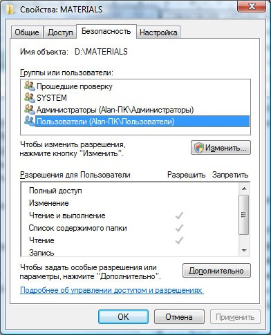
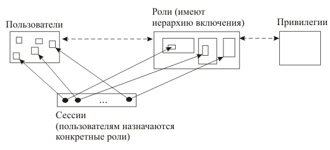

---
## Front matter
title: "Доклад по теме:

Основные модели безопасности ОС"
subtitle: ""
author: "Выполнил студент: Самсонова Мария Ильинична, 

НФИбд-02-21, 1032216526

Преподаватель Кулябов Дмитрий Сергеевич 

д.ф.-м.н., профессор кафедры 

прикладной информатики и теории вероятностей"

## Generic otions
lang: ru-RU
toc-title: "Содержание"

## Bibliography
bibliography: bib/cite.bib
csl: pandoc/csl/gost-r-7-0-5-2008-numeric.csl

## Pdf output format
toc: true # Table of contents
toc-depth: 2
fontsize: 12pt
linestretch: 1.5
papersize: a4
documentclass: scrreprt
## I18n polyglossia
polyglossia-lang:
  name: russian
  options:
	- spelling=modern
	- babelshorthands=true
polyglossia-otherlangs:
  name: english
## I18n babel
babel-lang: russian
babel-otherlangs: english
## Fonts
mainfont: PT Serif
romanfont: PT Serif
sansfont: PT Sans
monofont: PT Mono
mainfontoptions: Ligatures=TeX
romanfontoptions: Ligatures=TeX
sansfontoptions: Ligatures=TeX,Scale=MatchLowercase
monofontoptions: Scale=MatchLowercase,Scale=0.9
## Biblatex
biblatex: true
biblio-style: "gost-numeric"
biblatexoptions:
  - parentracker=true
  - backend=biber
  - hyperref=auto
  - language=auto
  - autolang=other*
  - citestyle=gost-numeric
## Pandoc-crossref LaTeX customization
figureTitle: "Рис."
tableTitle: "Таблица"
listingTitle: "Листинг"
lolTitle: "Листинги"
## Misc options
indent: true
header-includes:
  - \usepackage{indentfirst}
  - \usepackage{float} # keep figures where there are in the text
  - \floatplacement{figure}{H} # keep figures where there are in the text
---

# Информация о докладчике

:::::::::::::: {.columns align=center}
::: {.column width="70%"}

  * Самсонова Мария Ильинична
  * Студент группы НФИбд-02-21
  * Студенческий билет 1032216526
  * Российский университет дружбы народов

:::
::: {.column width="30%"}

:::
::::::::::::::

# Цель

Цель данного реферата заключается в рассмотрении и анализе моделей безопасности, применяемых в операционных системах. Для лучшего понимания мы выполним следующие задачи:
•  Дадим описание базовых понятий безопасности ОС.
•  Рассмотрим основные модели безопасности.
•  Проанализируем примеры использования моделей в современных ОС.

# Введение

В современном цифровом мире операционные системы (ОС) играют ключевую роль в функционировании практически всех информационных систем — от персональных компьютеров и мобильных устройств до серверов, управляющих инфраструктурой глобальных корпораций и государственных учреждений. С ростом цифровизации и повсеместным внедрением технологий возросли и угрозы, связанные с информационной безопасностью. Мошенничество, хакерские атаки, несанкционированный доступ к конфиденциальным данным и нарушение работы критически важных систем стали серьезными проблемами, с которыми сталкиваются как частные, так и государственные организации.

Операционные системы, будучи основой взаимодействия между программным обеспечением и аппаратными компонентами, несут на себе основную нагрузку по обеспечению безопасности данных и контроля доступа к ресурсам. Уязвимости в ОС могут привести к катастрофическим последствиям: утечке конфиденциальной информации, финансовым потерям и угрозам национальной безопасности.

В условиях стремительного роста количества подключенных устройств (IoT), перехода на облачные технологии и увеличения зависимости от цифровых сервисов, обеспечение безопасности операционных систем становится первостепенной задачей. На первый план выходит необходимость разработки и применения надежных моделей безопасности, которые способны предотвратить несанкционированный доступ, защитить данные и гарантировать целостность информационных систем. Модели безопасности ОС обеспечивают стандартизированный подход к управлению доступом и защите информации, что делает их критически важными элементами в общей стратегии кибербезопасности.

# Теоретические сведения 
## Основные понятия безопасности операционных систем

Безопасность операционной системы — это совокупность мер, направленных на защиту данных и ресурсов компьютера от несанкционированного доступа, кражи, модификации и разрушения. Безопасность ОС охватывает не только защиту от внешних угроз (взлом, вирусы, кибератаки), но и внутренние аспекты, такие как управление правами доступа пользователей и контроль выполнения приложений.
Ключевые аспекты безопасности ОС:

•  Управление доступом: Определение, кто и какие ресурсы может использовать.

•  Аутентификация: Подтверждение личности пользователя или системы.

•  Автономная защита: Способность системы работать в условиях отключения внешних сервисов или сетей без снижения уровня безопасности.

•  Шифрование данных: Защита данных как в состоянии хранения, так и при передаче между компонентами системы.

•  Логирование и мониторинг: Отслеживание действий пользователей и событий, происходящих в системе для выявления и предотвращения потенциальных угроз.

Безопасность ОС — это неотъемлемый компонент всей системы безопасности информационной инфраструктуры, так как от неё зависят все остальные слои защиты.

## Цели безопасности: Конфиденциальность, целостность, доступность
Основные цели безопасности операционной системы выражаются в трёх ключевых принципах:

•  Конфиденциальность: Обеспечение того, что информация доступна только тем пользователям, у которых есть на это разрешение. Это достигается за счет систем контроля доступа и шифрования данных.

•  Целостность: Гарантия того, что данные не могут быть изменены или уничтожены неавторизованными лицами. Это защищает информацию от преднамеренных и случайных модификаций.

•  Доступность: Уверенность в том, что информация и ресурсы будут доступны пользователям и процессам тогда, когда это необходимо.
Атаки, такие как DDoS, направлены на снижение доступности системы, и предотвращение таких атак является важной задачей безопасности.
Эти три принципа (часто называемые триадой CIA — Confidentiality, Integrity, Availability) являются основополагающими для построения любой модели безопасности операционных систем.

## Угрозы безопасности: Внутренние и внешние угрозы
Безопасность операционных систем находится под угрозой как изнутри, так и снаружи. Эти угрозы можно разделить на две основные категории:
•  Внутренние угрозы:

1)  Привилегированные пользователи: Системные администраторы или пользователи с высоким уровнем доступа могут намеренно или случайно повредить систему, получить несанкционированный доступ к данным или изменить настройки безопасности.

2)  Ошибки пользователей: Некорректные действия пользователей, такие как использование слабых паролей, неосторожная работа с файлами или несоответствующее применение прав доступа, могут привести к утечке данных или уязвимости системы.

3)  Внутренние атаки: Пользователи внутри организации могут намеренно использовать свои привилегии для кражи данных или нанесения ущерба.

•  Внешние угрозы:

1)  Хакеры и кибератаки: Внешние злоумышленники, пытающиеся получить доступ к системе через интернет или локальные сети, могут использовать эксплойты и уязвимости для взлома системы.

2)  Вирусы и вредоносные программы: Вредоносные программы, такие как вирусы, черви, трояны и руткиты, могут нарушить работу системы, украсть или повредить данные.

3)  Атаки на отказ в обслуживании (DDoS): Цель этих атак — вывести из строя систему или сервис, сделав их недоступными для законных пользователей.

Эффективное управление угрозами безопасности требует комплексного подхода, который включает в себя как технические меры, так и организационные процессы, такие как контроль доступа, регулярные обновления систем и мониторинг активности.

# Обзор моделей безопасности
## Определение понятия "модель безопасности"
**Модель безопасности** — это формализованный подход, который определяет, как система должна контролировать доступ к ресурсам и защищать данные от несанкционированного использования. Она представляет собой теоретическое описание принципов, механизмов и правил, на основе которых строится защита информации и ресурсов внутри операционной системы.

**Модель безопасности** описывает взаимоотношения между субъектами (пользователями, процессами) и объектами (данные, файлы, программы) системы, определяя, какие действия могут быть выполнены над объектами при различных уровнях доступа.

**Модель безопасности** играют ключевую роль в проектировании защищенных операционных систем, поскольку они стандартизируют методы управления доступом и устанавливают правила, гарантирующие конфиденциальность, целостность и доступность данных.

## Что представляют собой модели безопасности?
Каждая модель безопасности **ориентирована** на достижение одной или нескольких ключевых целей безопасности, таких как конфиденциальность, целостность и доступность. Эти модели могут быть формализованы в виде правил и алгоритмов, которые затем реализуются на уровне ОС или специализированного программного обеспечения для защиты данных.

*Основные элементы моделей безопасности*

•  Субъекты — пользователи или процессы, которые запрашивают доступ к ресурсам.

•  Объекты — ресурсы, к которым запрашивается доступ (файлы, данные, приложения).

•  Правила доступа — условия, которые определяют, может ли субъект выполнить определенные действия с объектом.

Модели безопасности обычно делятся на категории в зависимости от того, какие аспекты безопасности они защищают и какие принципы управления доступом используют. Некоторые из моделей больше ориентированы на защиту конфиденциальности, в то время как другие делают акцент на целостности данных. 

Давайте перечислим основные типы.

# Основные типы моделей безопасности
## Дискреционные модели безопасности (Discretionary Access Control, DAC)

**Дискреционные модели** безопасности управляют правами доступа к ресурсам через владельцев этих ресурсов. Владельцы сами назначают или изменяют права доступа для других пользователей, основываясь на их идентичности.[1]

Каждому объекту назначен субъект-владелец, который определяет, кто имеет доступ к объекту и какие операции разрешены. Основные операции включают: чтение (READ), запись (WRITE) и выполнение (EXECUTE, актуально только для программ). Таким образом, в модели дискреционного доступа для каждой пары субъект-объект задается разрешенный набор операций.

При запросе доступа система проверяет наличие субъекта в списке прав доступа к объекту. Если субъект присутствует в списке и разрешенный тип доступа соответствует запрашиваемому, доступ предоставляется. В противном случае — отказывается.

Классическая система дискреционного контроля доступа считается «закрытой», где изначально доступ к объекту закрыт для всех, и разрешения явно указываются в списке прав доступа. Существуют также «открытые» системы, где изначально доступ предоставлен всем, а в списке указываются ограничения.
Дискреционная модель реализована в операционных системах, таких как Windows и Linux (см. рис. 1).

В частности, в Linux каждому файлу (все ресурсы, включая устройства ввода-вывода, представлены в виде файлов) назначаются права доступа для трех категорий: владелец, группа владельца и остальные пользователи. Для каждой категории устанавливаются права на чтение (r), запись (w) и выполнение (x). Права доступа могут быть представлены в виде строки, например, «rwxr-xr--». Это означает, что владелец может выполнять любые операции с файлом, члены группы могут читать и исполнять его, а остальные пользователи — только читать.

*Недостатки DAC:* Главный недостаток заключается в том, что субъект, имеющий право на чтение, может передать информацию другим, лишенным этого права, без уведомления владельца. Это создает риск неконтролируемого распространения данных. Кроме того, не во всех системах можно назначить владельца каждому объекту, так как в некоторых случаях данные принадлежат всей системе, а не отдельным пользователям.

## Мандатные модели безопасности (Mandatory Access Control, MAC)

**Мандатная модель безопасности** основана на мандатном управлении доступом. *Мандатное управление доступом* (Mandatory Access Control, MAC) — это механизм, основанный на присвоении меток конфиденциальности объектам и официальных разрешений (допусков) субъектам на доступ к информации определённого уровня. Такой подход предотвращает несанкционированное использование компьютерных процессов, данных и системных устройств. Иногда MAC также называют «Принудительным контролем доступа».
  
В мандатных моделях безопасности контроль доступа осуществляется на системном уровне и не может быть изменён пользователями. Система назначает метки безопасности субъектам и объектам, а доступ регулируется в соответствии с этими метками и установленными правилами.[2]

*Приведем пример работы мандатной модели безопасности:* 
Субъект «Пользователь № 2» с допуском уровня «не секретно» не может получить доступ к объекту с меткой «для служебного пользования». В то же время субъект «Пользователь № 1» с допуском уровня «секретно» имеет доступ к этому объекту в режиме «только чтение». Если «Пользователь № 1» вносит изменения в объект, он обязан сохранить его в каталоге с меткой «секретно».

Мандатная модель доступа является одной из ключевых для защиты информации ограниченного доступа и часто используется совместно с другими моделями, такими как дискреционная или ролевая. В файловых системах MAC может расширять или заменять дискреционный контроль доступа, управляя пользователями и группами на более строгом уровне.

**Главное преимущество** этой модели заключается в том, что пользователи не могут самостоятельно управлять доступом к ресурсам, которые они создают. Политика безопасности системы, установленная администратором, полностью контролирует доступ. Пользователи не могут установить более свободный доступ к своим ресурсам, чем разрешено администратором, что предотвращает случайную или намеренную передачу прав неавторизованным пользователям.

MAC также гарантирует, что пользователь или процесс с определённым уровнем доверия не получит доступ к объектам, процессам или устройствам с более высоким уровнем защиты, обеспечивая изоляцию данных и операций. Эта система должна быть построена таким образом, чтобы её нельзя было обойти, и она должна защищаться от постороннего вмешательства.

**Принципы мандатного контроля доступа** впервые были реализованы в операционных системах, ориентированных на безопасность, таких как Flask. В 2003 году проект АНБ SELinux добавил архитектуру MAC к ядру Linux, что сделало эту модель частью основной ветви разработки. Мандатные системы доступа также реализованы в FreeBSD Unix, AppArmor для SUSE Linux и Ubuntu.

Кроме того, в операционных системах, сертифицированных Минобороны России и ФСТЭК (таких как МСВС, Astra Linux Special Edition, Стрелец), механизм мандатного разграничения доступа реализован наряду с дискреционным контролем доступа на уровне ядра ОС. Решения о доступе принимаются на основе типа операции (чтение/запись/исполнение), мандатного контекста безопасности субъекта и метки безопасности объекта.

## Модели с ролевым разграничением доступа (Role-Based Access Control, RBAC)
В ролевых моделях доступ к ресурсам регулируется на основании ролей, назначаемых пользователям. Каждая роль содержит набор прав доступа, и пользователи получают доступ в зависимости от своей роли, а не индивидуальных разрешений.[3]

**Ролевая модель** управления доступом определяет доступ пользователей к ресурсам на основе их ролей в системе, которые отражают их действия и обязанности. **Роль** — это совокупность действий, соответствующих определённой должности или функции. Примеры ролей включают: администратор базы данных, менеджер, начальник отдела.

В ролевой модели каждому объекту назначаются разрешённые операции для каждой роли, а пользователям присваиваются соответствующие роли. В некоторых системах пользователям разрешается выполнять несколько ролей одновременно, в других может быть ограничение на выполнение только одной роли в каждый момент времени.
*Для формального описания RBAC используются следующие элементы:*
•  S = субъект — человек или автоматизированный агент.
•  R = роль — рабочая функция или название, определяется на уровне авторизации.
•  P = разрешения — утверждения режима доступа к ресурсу.
•  SE = cессия — Соответствие между S, R и/или P.
•  SA = назначение субъекта (Subject Assignment).  . При этом субъекты назначаются связям ролей и субъектов в отношении «многие ко многим» (один субъект может иметь несколько ролей, а одну роля могут иметь несколько субъектов).
•  PA = назначение разрешения (Permission Assignment).  . При этом разрешения назначаются связям ролей в отношении «многие ко многим».
•  RH = частично упорядоченная иерархия ролей (Role Hierarchy).  .
  Ограничения накладываются на возможность наследования прав, что обеспечивает надлежащий уровень безопасности. Например, одному пользователю может быть запрещено создавать учетную запись для кого-то и затем авторизоваться под этой учетной записью, что обеспечивает разделение обязанностей.[4]
  

*Основные преимущества ролевой модели:*

1.  Простота администрирования. В отличие от дискреционной модели (DAC), нет необходимости задавать права для каждой пары «объект-пользователь». Вместо этого права определяются для пар «объект-роль», а роли назначаются пользователям. При изменении должностных обязанностей пользователю достаточно изменить его роли. Иерархия ролей, при которой роли могут наследовать привилегии других ролей, также упрощает администрирование.

2.  Принцип наименьшей привилегии. RBAC позволяет пользователю регистрироваться под минимально необходимой для выполнения задачи ролью. Это предотвращает получение избыточных привилегий, которые могли бы нарушить политику безопасности.

3.  Разделение обязанностей. RBAC обеспечивает строгий контроль за выполнением различных задач, предотвращая концентрацию слишком больших прав у одного пользователя.

Ролевая модель широко используется в системах управления доступом, таких как Microsoft Active Directory, SELinux, FreeBSD, Solaris, СУБД Oracle, PostgreSQL, SAP R/3 и других. С помощью RBAC можно моделировать как дискреционные, так и мандатные системы управления доступом.

Итак, в табличном виде представим краткую характеристику каждой модели.

Вот таблица, в которой сравниваются три модели безопасности ОС по их основным характеристикам:

| **Критерий**                       | **Дискреционная модель (DAC)**                                      | **Мандатная модель (MAC)**                                         | **Ролевая модель (RBAC)**                                           |
|-------------------------------------|--------------------------------------------------------------------|-------------------------------------------------------------------|--------------------------------------------------------------------|
| **Основной принцип**                | Владелец ресурса управляет доступом к нему                          | Доступ контролируется на системном уровне, метки безопасности      | Доступ определяется ролями, которые назначаются пользователям       |
| **Цель**                            | Гибкость и удобство для пользователей                               | Строгий контроль и защита конфиденциальной информации              | Простота администрирования, основанная на распределении ролей       |
| **Гибкость**                        | Высокая (владелец может назначать права)                            | Низкая (пользователи не могут менять права)                        | Средняя (гибкость через назначение ролей, но сложность при иерархиях)|
| **Уровень контроля**                | Контроль на уровне владельца ресурса                                | Контроль на системном уровне, пользователи не могут изменять права | Контроль через администраторов и роли                              |
| **Преимущества**                    |  Простота назначения прав на уровне объектов                       |  Строгая защита информации    Системный контроль доступа      |  Упрощенное администрирование    Масштабируемость через роли  |
| **Недостатки**                      |  Возможна утечка данных, если владелец передаст права    Невозможно гарантировать защиту | Ограничение гибкости пользователей    Сложность администрирования | Требует тщательного проектирования ролей    Возможны ограничения гибкости |
| **Пример использования**            | Linux (права владельцев файлов)                                     | SELinux (контроль на основе меток безопасности)                    | Microsoft Active Directory (управление доступом через роли)        |
| **Когда используется**              | В ситуациях, когда важно предоставить пользователям контроль над ресурсами | В системах с высокой степенью защиты, где важно избежать утечки информации | В крупных организациях, где важно администрирование через роли      |
| **Взаимодополнение**                | Может быть дополнена RBAC для управления через роли                 | Может дополняться RBAC для управления ролями на системном уровне   | Может дополняться DAC и MAC для гибкости и контроля безопасности    |

Эта таблица позволяет наглядно сравнить модели по основным критериям, целям и взаимодополняемости.

# Современные вызовы и тенденции в моделях безопасности ОС
С развитием технологий и усложнением IT-инфраструктур, традиционные модели безопасности ОС сталкиваются с новыми вызовами. Эти вызовы касаются как внешних угроз, так и внутренних аспектов самой безопасности систем. Текущие тенденции свидетельствуют о необходимости адаптации классических моделей безопасности к современным условиям, что выражается в появлении новых угроз и требований, а также в развитии гибридных подходов к обеспечению безопасности.

## Новые угрозы и уязвимости: Атаки на доверенные подсистемы
С ростом сложности операционных систем возрастает риск атак на доверенные компоненты и подсистемы, которые играют ключевую роль в обеспечении безопасности. Атаки на доверенные подсистемы, такие как ядро ОС или гипервизоры, становятся всё более изощрёнными и опасными. Примеры таких атак включают:
•  Эксплойты на уязвимости ядра. Злоумышленники находят уязвимости в ядре ОС, что позволяет им обходить механизмы контроля доступа или получать повышенные привилегии.

•  Атаки на цепочки доверия. Современные системы зависят от множества компонентов (драйверов, библиотек), и атаки на эти компоненты могут нарушить работу всей системы.

•  Угрозы через аппаратные уязвимости. Аппаратные уязвимости, такие как Spectre и Meltdown, показывают, что даже самые защищённые компоненты ОС могут быть атакованы через слабости в архитектуре процессора.

В ответ на эти угрозы современные ОС начинают применять дополнительные уровни защиты, такие как защита памяти (например, Data Execution Prevention, Address Space Layout Randomization) и более строгие модели изоляции процессов. Однако для решения таких проблем недостаточно одной модели безопасности — требуется их комбинация.

## Развитие гибридных моделей: Объединение нескольких моделей безопасности

Сложность современных систем требует более гибких и комплексных подходов к управлению безопасностью. В этом контексте развивается тренд на создание гибридных моделей безопасности, которые сочетают преимущества дискреционной (DAC), мандатной (MAC) и ролевой (RBAC) моделей. Объединение этих подходов позволяет более эффективно решать задачи безопасности в различных сценариях:

•  DAC + MAC: Совместное использование дискреционной и мандатной моделей позволяет достичь баланса между гибкостью управления доступом и строгим контролем над конфиденциальной информацией. Например, SELinux использует элементы как MAC, так и DAC, что делает систему более безопасной.

•  RBAC + DAC: Включение ролей в дискреционные модели позволяет упростить администрирование и повысить безопасность за счет ограничения привилегий пользователей через роли. Это особенно полезно в крупных организациях, где управление доступом должно быть масштабируемым. 

•  RBAC + MAC: В корпоративных и государственных системах можно наблюдать симбиоз мандатной модели и ролевой, где администраторы используют строгие политики контроля доступа, а пользователи работают с ограниченными ролями для выполнения определённых задач. Это уменьшает риск несанкционированного доступа и упрощает соблюдение требований безопасности.

Такое объединение моделей помогает преодолеть недостатки каждой из них и обеспечивает более многоуровневую защиту данных. Кроме того, гибридные модели проще масштабируются в динамических средах, таких как облачные системы и корпоративные сети.

## Безопасность в облачных операционных системах
С массовым переходом организаций на облачные технологии, задачи безопасности приобретают новый уровень сложности. Облачные операционные системы (такие как Microsoft Azure, AWS, Google Cloud) сталкиваются с особыми вызовами, связанными с многоарендностью, виртуализацией и распределенными ресурсами. В таких системах становится критически важным управление доступом, разделение данных и защита от внешних атак.

Основные тенденции в области безопасности облачных ОС:

•  Многоуровневая аутентификация и авторизация: В облачных системах доступ к ресурсам должен быть разделен на несколько уровней. Совмещение RBAC с DAC и MAC позволяет более гибко управлять правами пользователей, гарантируя, что ни один пользователь или процесс не получит несанкционированный доступ.

•  Контроль за виртуальными машинами и контейнерами: Облачные системы активно используют виртуализацию (VM) и контейнеризацию (Docker, Kubernetes). Виртуальные машины и контейнеры должны быть защищены на уровне ОС от несанкционированного доступа или утечек данных. Для этого часто применяются механизмы MAC для контроля за взаимодействием контейнеров и хост-системы.

•  Изоляция арендаторов и разделение данных: В облачных ОС критично важно, чтобы данные разных клиентов (арендаторов) были изолированы друг от друга. Арендатор не должен иметь возможности влиять на данные других клиентов, что достигается за счет строгого разделения на уровне операционной системы, поддерживающей многоарендность.

•  Шифрование данных: Одним из ключевых аспектов безопасности в облачных ОС является шифрование данных как в состоянии покоя (на диске), так и при передаче между облаком и пользователем. Современные модели безопасности должны учитывать необходимость шифрования на уровне ОС и системы хранения данных.

Таким образом, безопасность в облачных операционных системах требует сочетания всех трёх моделей — DAC, MAC и RBAC — для создания комплексной системы защиты данных и управления доступом.

# Заключение

В ходе данного доклада были рассмотрены основные модели безопасности операционных систем: дискреционная (DAC), мандатная (MAC) и ролевая (RBAC) модели. Каждая из этих моделей обладает своими уникальными характеристиками и методами управления доступом, что позволяет эффективно защищать данные в различных сценариях использования.

Рассмотренные модели играют ключевую роль в обеспечении информационной безопасности, влияя на защиту данных на нескольких уровнях. Дискреционная модель предоставляет гибкость в управлении доступом, позволяя пользователям назначать права другим субъектам, но в то же время требует внимательного контроля за передачей прав, чтобы избежать утечек информации. Мандатная модель, в свою очередь, обеспечивает строгий контроль доступа на основе предопределённых политик, минимизируя риски несанкционированного доступа к конфиденциальной информации. Ролевая модель упрощает администрирование прав доступа, позволяя организациям быстро адаптироваться к изменениям в обязанностях пользователей и обеспечивая принцип наименьших привилегий.

Современные вызовы, с которыми сталкиваются операционные системы, требуют постоянной адаптации и эволюции этих моделей. Интеграция и развитие гибридных моделей, а также акцент на безопасность в облачных операционных системах демонстрируют, что для эффективной защиты данных необходимо учитывать специфику современных угроз и технологий.

Таким образом, влияние моделей безопасности на защиту данных неоспоримо: они обеспечивают структурированный подход к управлению доступом, защищая информацию от утечек и несанкционированного доступа. В условиях постоянного роста числа угроз и уязвимостей эти модели остаются краеугольным камнем в архитектуре безопасности современных информационных систем.

# Библиографический обзор

[1] Основные положения модели информационной безопасности иерархических распределительных систем. К.Н. Филькин. URL: https://core.ac.uk/download/pdf/53065572.pdf

[2] Информационная безопасность в современных системах управления базами данных. Дата обращения: 4 октября 2024. Архивировано 7 мая 2019 года. URL: https://compress.ru/article.aspx?id=10099&iid=419

[3] Sandhu R. Coynek E., Feinsteink H., Youman C. Role-Based Access Control // IEEE Computer. – 1996. – № 29(2). – P. 38–47.

[4]  NIST Computer Security Division - Automated Combinatorial Testing for Software (ACTS). csrc.nist.gov. Дата обращения: 4 октября 2024. Архивировано 21 июня 2016 года. URL: https://csrc.nist.gov/projects/role-based-access-control/faqs#02
