---
## Front matter
lang: ru-RU
title: "Этап индивидуального проекта №1"
subtitle: "Установка и конфигурация операционной системы на виртуальную машину"
author: " Самсонова М.И. Группа НФИбд-02-21 "

## i18n babel
babel-lang: russian 
babel-otherlangs: english 
mainfont: Arial 
monofont: Courier New 
fontsize: 12pt

## Formatting pdf
toc: false
toc-title: Содержание
slide_level: 2
aspectratio: 169
section-titles: true
theme: metropolis
header-includes:
 - \metroset{progressbar=frametitle,sectionpage=progressbar,numbering=fraction}
 - '\makeatletter'
 - '\beamer@ignorenonframefalse'
 - '\makeatother'
---

# Цель работы

Настроить рабочее пространство для индивидуального проекта, приобрести практические навыки установки операционной системы на виртуальную машину и настройки минимально необходимых для дальнейшей работы сервисов.

# Теоретическое введение

**Oracle VM VirtualBox** — это мощная и бесплатная виртуализационная платформа, разработанная корпорацией Oracle, которая позволяет пользователям создавать и управлять виртуальными машинами на своих компьютерах. [1]

**Kali Linux (ранее известный как BackTrack Linux)** - это дистрибутив Linux на базе Debian с открытым исходным кодом, который позволяет пользователям проводить расширенное тестирование на проникновение и аудит безопасности. Он работает на нескольких платформах и находится в свободном доступе как для профессионалов в области информационной безопасности, так и для любителей.

Этот дистрибутив содержит несколько сотен инструментов, конфигураций и сценариев с отраслевыми модификациями, которые позволяют пользователям сосредоточиться на таких задачах, как компьютерная экспертиза, реверс-инжиниринг и обнаружение уязвимостей, вместо того чтобы заниматься несвязанными действиями.

Этот дистрибутив специально разработан с учетом потребностей опытных тестировщиков на проникновение, поэтому вся документация на этом сайте предполагает предварительное знание операционной системы Linux в целом. [2]

# Установка и конфигурация операционной системы на виртуальную машину

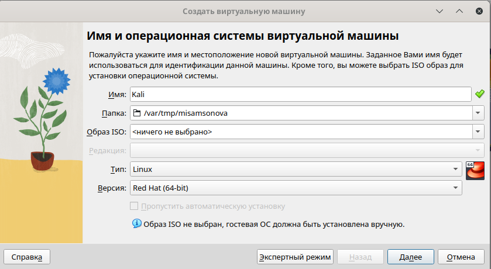{ #fig:001 width=70% height=70% }

# Установка и конфигурация операционной системы на виртуальную машину

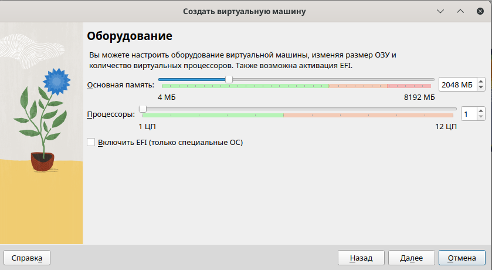{ #fig:002 width=70% height=70% }

# Установка и конфигурация операционной системы на виртуальную машину

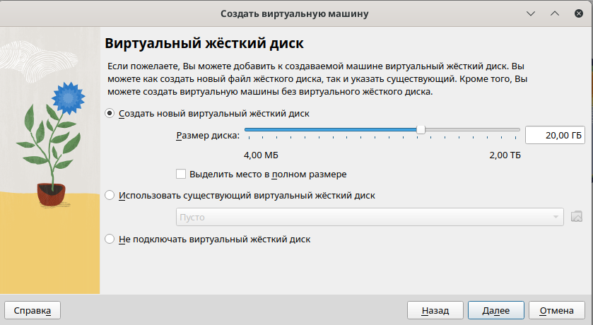{ #fig:0043width=70% height=70% }

# Установка и конфигурация операционной системы на виртуальную машину

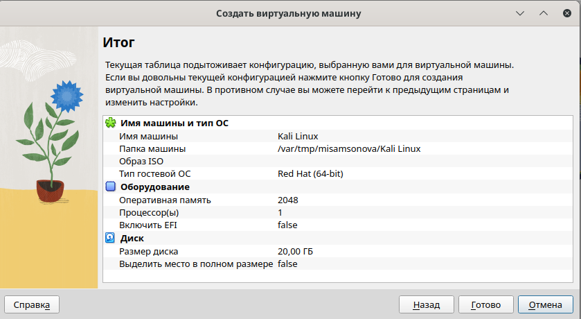{ #fig:004 width=70% height=70% }

# Установка носителя на виртуальную машину

{ #fig:005 width=70% height=70% }

# Запуск и настройки установленной работы

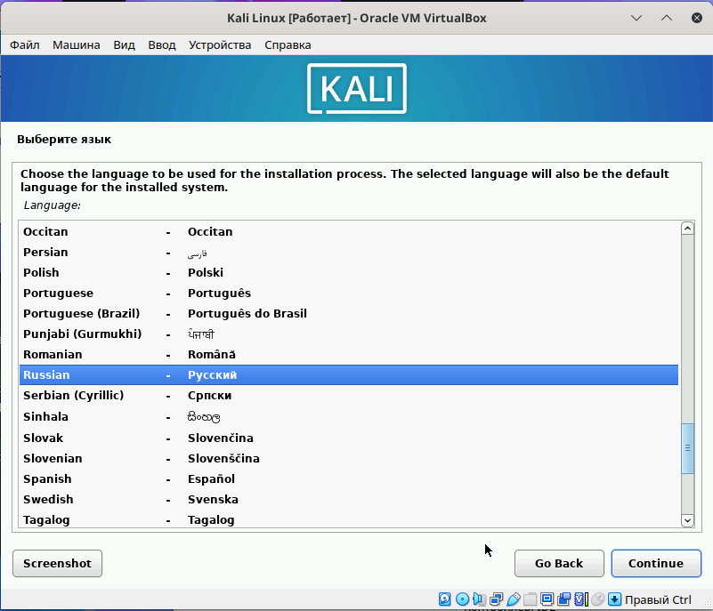{ #fig:006 width=70% height=70% }

# Настройки клавиатуры

{ #fig:007 width=70% height=70% }

# Настройки клавиатуры

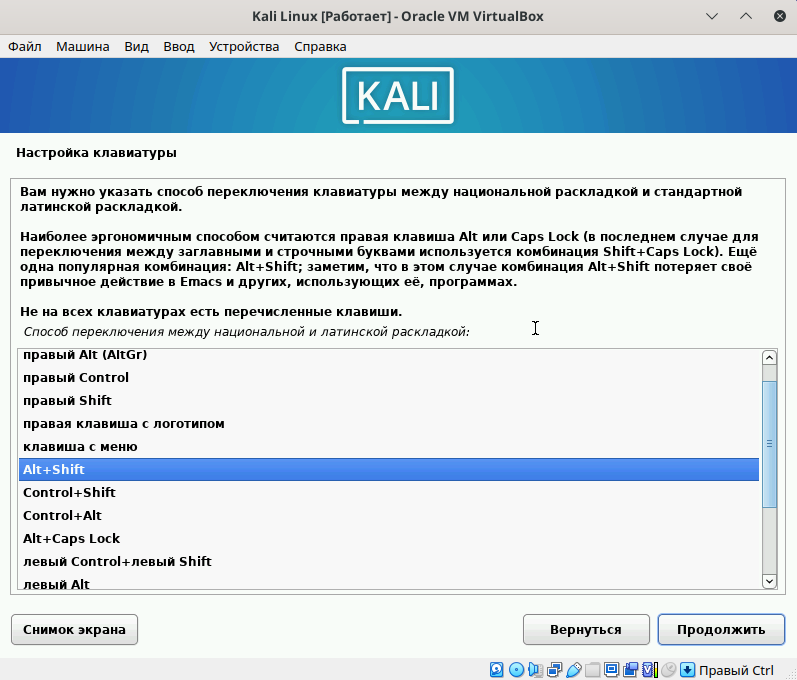{ #fig:008 width=70% height=70% }

#  Запуск компонентов с установочного носителя

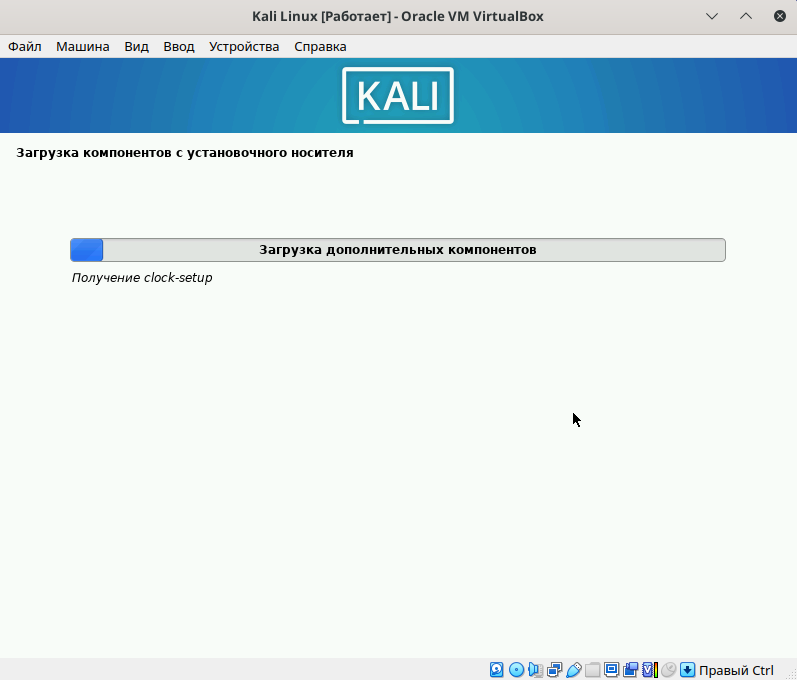{ #fig:009 width=70% height=70% }

# Настройки сети

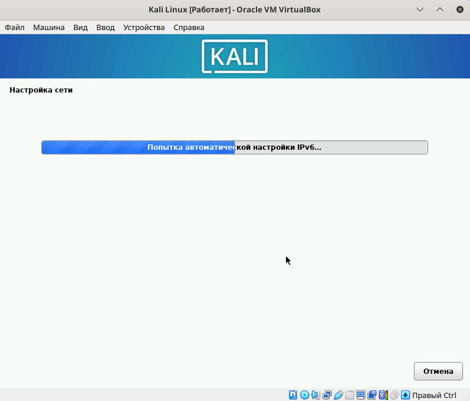{ #fig:010 width=70% height=70% }

# Настройки сети

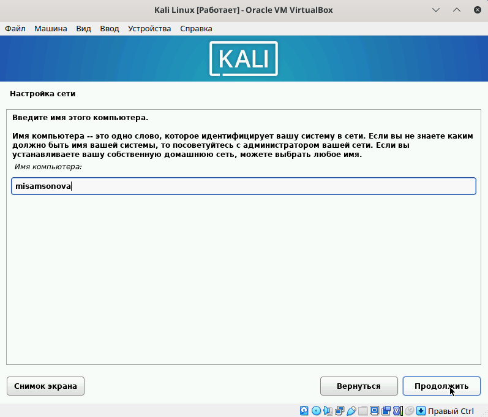{ #fig:011 width=70% height=70% }

# Настройка учетной записи пользователя 

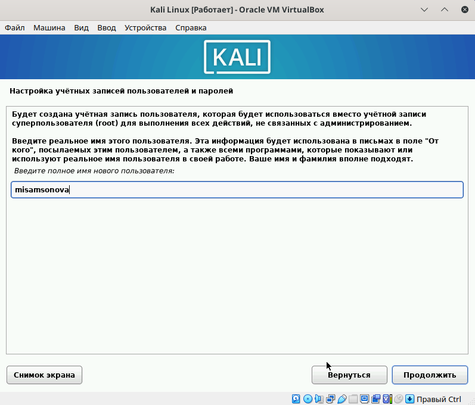{ #fig:012 width=70% height=70% }

# Настройка пароля для учетной записи

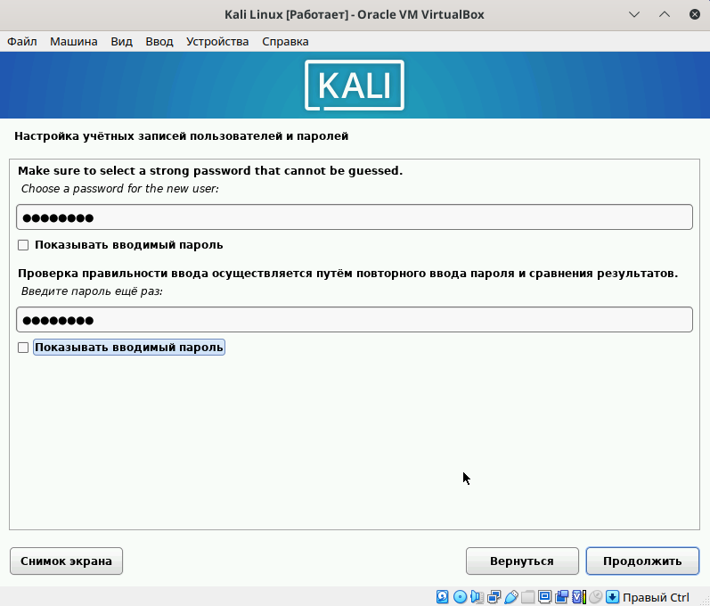{ #fig:013 width=70% height=70% }

# Разметка дисков

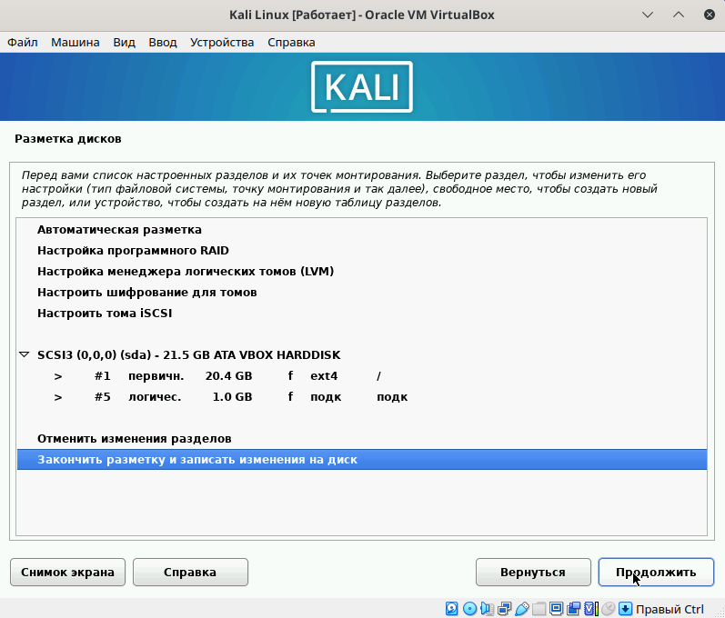{ #fig:014 width=70% height=70% }

# Установка базовой системы

{ #fig:015 width=70% height=70% }

# Завершение установки дистрибутива Kali

{ #fig:016 width=70% height=70% }

# Переход в ОС Linux

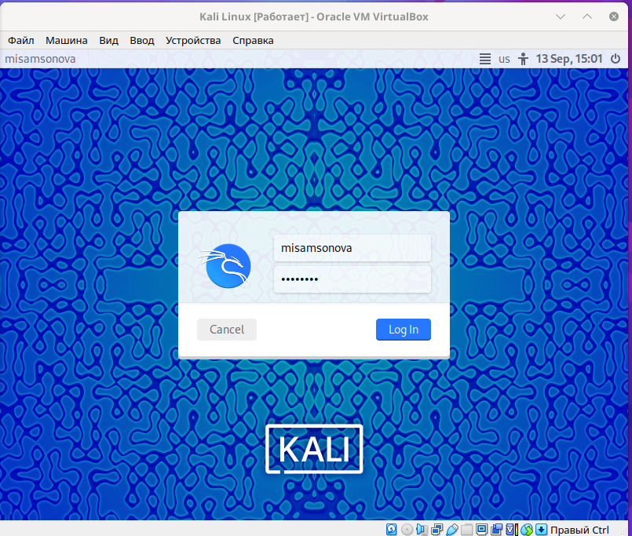{ #fig:017 width=70% height=70% }

# Переход в ОС Linux

{ #fig:018 width=70% height=70% }

# Вывод

Были настроено рабочее пространство для индивидуального проекта, приобретены практические навыки установки операционной системы на виртуальную машину и настройки минимально необходимых для дальнейшей работы сервисов.

# Список литературы. Библиография

[1] Документация по Virtual Box: https://www.virtualbox.org/wiki/Documentation

[2] Документация по Kali Linux: https://www.kali.org/docs/