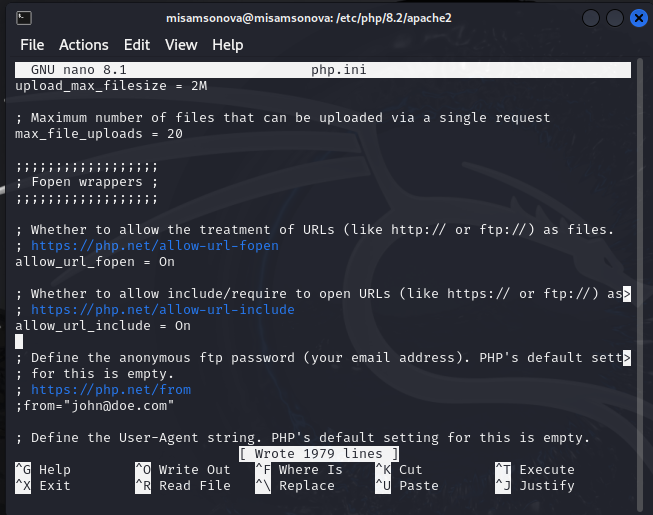

---
## Front matter
lang: ru-RU
title: Презентация по второму этапу индивидуального проекта
subtitle: Информационная безопасность
author: |
        Самсонова Мария Ильинична
        \        
        НФИбд-02-21
        \
        Студ. билет: 1032216526
institute: |
           RUDN
date: |
      2024

babel-lang: russian
babel-otherlangs: english
mainfont: Arial
monofont: Courier New
fontsize: 9pt

## Formatting
toc: false
slide_level: 2
theme: metropolis
header-includes: 
 - \metroset{progressbar=frametitle,sectionpage=progressbar,numbering=fraction}
 - '\makeatletter'
 - '\beamer@ignorenonframefalse'
 - '\makeatother'
aspectratio: 43
section-titles: true
---

# Цель работы

Приобретение практических навыков по установке DVWA.

# Задание

Установить DVWA на дистрибутив Kali Linux.

# Теоретическое введение

DVWA - это уязвимое веб-приложение, разработанное на PHP и MySQL.

Некоторые из уязвимостей веб приложений, который содержит DVWA:
- Брутфорс: Брутфорс HTTP формы страницы входа - используется для тестирования инструментов по атаке на пароль методом грубой силы и показывает небезопасность слабых паролей.
- Исполнение (внедрение) команд: Выполнение команд уровня операционной системы.
- Межсайтовая подделка запроса (CSRF): Позволяет «атакующему» изменить пароль администратора приложений.
- Внедрение (инклуд) файлов: Позволяет «атакующему» присоединить удалённые/локальные файлы в веб приложение.
- SQL внедрение: Позволяет «атакующему» внедрить SQL выражения в HTTP из поля ввода, DVWA включает слепое и основанное на ошибке SQL внедрение.
- Небезопасная выгрузка файлов: Позволяет «атакующему» выгрузить вредоносные файлы на веб сервер.
- Межсайтовый скриптинг (XSS): «Атакующий» может внедрить свои скрипты в веб приложение/базу данных. DVWA включает отражённую и хранимую XSS.
- Пасхальные яйца: раскрытие полных путей, обход аутентификации и некоторые другие.

# Теоретическое введение

DVWA имеет три уровня безопасности, они меняют уровень безопасности каждого веб приложения в DVWA:
1) Невозможный — этот уровень должен быть безопасным от всех уязвимостей. Он используется для сравнения уязвимого исходного кода с безопасным исходным кодом.
Высокий — это расширение среднего уровня сложности, со смесью более сложных или альтернативных плохих практик в попытке обезопасить код. Уязвимости не позволяют такой простор эксплуатации как на других уровнях.
2) Средний — этот уровень безопасности предназначен главным образом для того, чтобы дать пользователю пример плохих практик безопасности, где разработчик попытался сделать приложение безопасным, но потерпел неудачу.
3) Низкий — этот уровень безопасности совершенно уязвим и совсем не имеет защиты. Его предназначение быть примером среди уязвимых веб приложений, примером плохих практик программирования и служить платформой обучения базовым техникам эксплуатации.

# Выполнение лабораторной работы

1. Передем в директорию /var/www/html для настройки DVWA на локальном хосте. Далее клонируем нужный репозиторий GitHub.

{#fig:001 width=70%}

# Выполнение лабораторной работы

2. Проверим, что файлы склонировались правильно, далее повышаю права доступа к этой папке до 777 (рис. 2.)

{#fig:002 width=70%}

# Выполнение лабораторной работы

3. Чтобы настроить DVWA, нужно перейти в каталог `/dvwa/config`, затем проверяю содержимое каталога (рис. 3)

{#fig:003 width=70%}

# Выполнение лабораторной работы

4. Создаем копию файла, используемого для настройки DVWA `config.inc.php.dist` с именем `config.inc.php`. Копируем файл, а не изменяем его, чтобы у нас был запасной вариант, если что-то пойдет не так (рис. 4)

{#fig:004 width=70%}

# Выполнение лабораторной работы

5. Далее открываем файл в текстовом редакторе (рис. 5)

{#fig:005 width=70%}

# Выполнение лабораторной работы

6. Изменяем данные об имени пользователя и пароле (рис. 6)

{#fig:006 width=70%}

# Выполнение лабораторной работы

7. По умолчанию в Kali Linux установлен mysql, поэтому можно его запустить без предварительного скачивания, далее выполняю проверку, запущен ли процесс (рис. 7)

{#fig:007 width=70%}

# Выполнение лабораторной работы

8. Авторизиризовываемся в базе данных от имени пользователя root. Появляется командная строка с приглашением "MariaDB", далее создаем в ней нового пользователя, используя учетные данные из файла config.inc.php (рис. 8)

{#fig:008 width=70%}

# Выполнение лабораторной работы

9. Теперь нужно пользователю предоставить привилегии для работы с этой базой данных (рис. 9)

{#fig:009 width=70%}

# Выполнение лабораторной работы

10. Необходимо настроить сервер apache2, переходим в соответствующую директорию (рис. 10)

{#fig:010 width=70%}

# Выполнение лабораторной работы

11. В файле `php.ini` нужно будет изменить один параметр, поэтому открываем файл в текстовом редакторе (рис. 11)

{#fig:011 width=70%}

# Выполнение лабораторной работы

12. В файле параметры allow_url_fopen и allow_url_include должны быть поставлены как `On` (рис. 12)

{#fig:012 width=70%}

# Выполнение лабораторной работы

13. Запускаем службу веб-сервера apache и проверяем, запущена ли служба (рис. 13)

{#fig:013 width=70%}

# Выполнение лабораторной работы

14. Мы настроили DVWA, Apache и базу данных, поэтому открываем браузер и запускаем веб-приложение, введя 127.0.0/DVWA (рис. 14)

{#fig:014 width=70%}

# Выполнение лабораторной работы

15. Прокручиваем страницу вниз и нажимем на кнопку `create\reset database` (рис. 15)

{#fig:015 width=70%}

# Выполнение лабораторной работы

16. Авторизуемся с помощью предложенных по умолчанию данных (рис. 16)

{#fig:016 width=70%}

# Выполнение лабораторной работы

17. Оказываюсь на домшней странице веб-приложения, на этом установка окончена (рис. 17)

{#fig:017 width=70%}

# Выводы

Выполнив первый этап индивидуального проекта, мы приобрели практические навыки по установке уязвимового веб-приложения DVWA.

# Список литературы{.unnumbered}

::: {#refs}
:::
